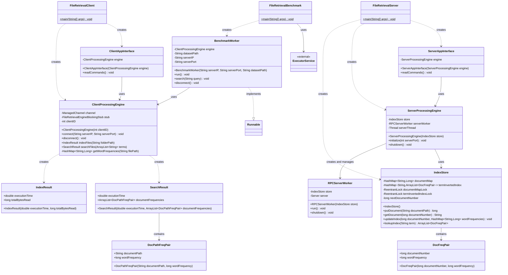

## Information Retrieval Engine - Client Server - gRPC

### Intro

I have built an Information Retrieval Engine system which demonstrates the implementation of three important concepts of distributed systems: application layering, multithreading, and client-server architecture using gRPC for inter-process communication. This Information Retrieval Engine supports indexing or traversing files from a specified input folder and also supports searching of indexed or traversed documents when a user gives a multiple term query. Upon providing search words, this application will search those words across all the traversed and read files and finally returns a list of top documents contaning those search words in the order of their frequency. While some of the source code was carried over from previous projects where we built monolithic and multithreaded versions of the InformationRetrieval Engine, this project transforms the system to use gRPC Remote Procedure Calls instead of POSIX sockets for client-server communication.

Implementing this project using gRPC provides several advantages over traditional socket-based communication. The use of Protocol Buffers for message definition makes the interface between client and server more structured and type-safe. The client remains responsible for accessing datasets and performing partial indexing, where datasets are divided based on the number of clients. Each client is treated as a thread, with the benchmark program managing multiple client threads for performance testing.

The server side maintains two critical data structures: DocumentMap and TermInvertedIndex. Instead of raw socket communication, the server now exposes two main gRPC services: computeIndex and computeSearch. When a client performs indexing, it sends the partial index to the server through the computeIndex RPC, and when searching, it uses the computeSearch RPC to query the server's global index. The server processes these RPCs by accessing and modifying its hashtables (DocumentMap and TermInvertedIndex) in a thread-safe manner.

### System Design

This class diagram illustrates the core architecture of the search engine system.



### Directory Structure

After cloning this repository you will need to follow a specific directory structure to run the program.

* Enter into app-java directory: "cd app-java"
* Here, when you type "ls" you will be able to see datasets directory, java build file and src directory where my source code exists.
* You can acces my code if you want to by following the specific path: "cd src/main/java/csc435/app"
* After entering into the above path, type "ls" and you will find my source code files. If you wish to enter any source code file type "vi filename.java".

### Requirements

If you are implementing your solution in Java you will need to have Java 21.x and Maven 3.8.x installed on your systems. On Ubuntu 24.04 LTS you can install Java and Maven using the following commands:

```
sudo apt install openjdk-21-jdk maven
```

### Setup

There are 3 datasets (dataset1_client_server, dataset2_client_server, dataset3_client_server) that you need to use to evaluate the indexing performance of your solution.
Before you can evaluate your solution you need to download the datasets. You can download the datasets from the following link:

https://depauledu-my.sharepoint.com/:f:/g/personal/aorhean_depaul_edu/Ej4obLnAKMdFh1Hidzd1t1oBHY7IvgqXoLdKRg-buoiisw?e=SWLALa

After you finished downloading the datasets copy them to the dataset directory (create the directory if it does not exist).
Here is an example on how you can copy Dataset1 to the remote machine and how to unzip the dataset:

```
remote-computer$ mkdir datasets
local-computer$ scp dataset1_client_server.zip cc@<remote-ip>:<path-to-repo>/datasets/.
remote-computer$ cd <path-to-repo>/datasets
remote-computer$ unzip dataset1_client_server.zip
```

### Java solution
#### How to build/compile

To build the Java solution use the following commands:
```
cd app-java
mvn compile
mvn package
```

#### How to run application

To run the Java server (after you build the project) use the following command:
```
Port No. I used is 12345
java -cp target/app-java-1.0-SNAPSHOT.jar csc435.app.FileRetrievalServer <port>
```

To run the Java client (after you build the project) use the following command:
```
java -cp target/app-java-1.0-SNAPSHOT.jar csc435.app.FileRetrievalClient
```

To run the Java benchmark (after you build the project) use the following command:
```
java -cp target/app-java-1.0-SNAPSHOT.jar csc435.app.FileRetrievalBenchmark <server IP> <server port> <number of clients> [<dataset path>]
```

#### Example (2 clients and 1 server)

**Step 1:** start the server:

Server
```
Note: If while running dataset3, the server happens to crash. Then please do quit the server close the command prompt and restart the server and then repeat the same for client terminal as well. The program will run just fine.
java -cp target/app-java-1.0-SNAPSHOT.jar csc435.app.FileRetrievalServer 12345
>
```

**Step 2:** start the clients and connect them to the server:

Client 1
```
java -cp target/app-java-1.0-SNAPSHOT.jar csc435.app.FileRetrievalClient
> connect 127.0.0.1 12345
Connection successful!
```

Client 2
```
java -cp target/app-java-1.0-SNAPSHOT.jar csc435.app.FileRetrievalClient
> connect 127.0.0.1 12345
Connection successful!
```

**Step 3:** index files from the clients:

Client 1
```
> index ../datasets/dataset1_client_server/2_clients/client_1
Completed indexing 68383239 bytes of data
Completed indexing in 2.974 seconds
```

Client 2
```
> index ../datasets/dataset1_client_server/2_clients/client_2
Completed indexing 65864138 bytes of data
Completed indexing in 2.386 seconds
```

**Step 4:** search files from the clients:

Client 1
```
> search at
Search completed in 0.4 seconds
Search results (top 10 out of 0):
> search Worms
Search completed in 2.8 seconds
Search results (top 10 out of 12):
* client1:folder4/Document10553.txt:4
* client1:folder3/Document1043.txt:4
* client2:folder7/Document1091.txt:3
* client1:folder3/Document10383.txt:3
* client2:folder7/folderB/Document10991.txt:2
* client2:folder8/Document11116.txt:1
* client2:folder5/folderB/Document10706.txt:1
* client2:folder5/folderB/Document10705.txt:1
* client2:folder5/folderA/Document10689.txt:1
* client1:folder4/Document1051.txt:1
```

Client 2
```
> search distortion AND adaptation
Search completed in 3.27 seconds
Search results (top 10 out of 4):
* client2:folder7/folderC/Document10998.txt:6
* client1:folder4/Document10516.txt:3
* client2:folder8/Document11159.txt:2
* client2:folder8/Document11157.txt:2
```

**Step 5:** close and disconnect the clients:

Client 1
```
> quit
```

Client 2
```
> quit
```

**Step 6:** close the server:

Server
```
> quit
```

#### Example (benchmark with 2 clients and 1 server)

**Step 1:** start the server:

Server
```
java -cp target/app-java-1.0-SNAPSHOT.jar csc435.app.FileRetrievalServer 12345
>
```

**Step 2:** start the benchmark:

Benchmark
```
java -cp target/app-java-1.0-SNAPSHOT.jar csc435.app.FileRetrievalBenchmark 127.0.0.1 12345 2 ../datasets/dataset1_client_server/2_clients/client_1 ../datasets/dataset1_client_server/2_clients/client_2
Completed indexing 134247377 bytes of data
Completed indexing in 6.015 seconds
Searching at
Search completed in 0.4 seconds
Search results (top 10 out of 0):
Searching Worms
Search completed in 2.8 seconds
Search results (top 10 out of 12):
* client1:folder4/Document10553.txt:4
* client1:folder3/Document1043.txt:4
* client2:folder7/Document1091.txt:3
* client1:folder3/Document10383.txt:3
* client2:folder7/folderB/Document10991.txt:2
* client2:folder8/Document11116.txt:1
* client2:folder5/folderB/Document10706.txt:1
* client2:folder5/folderB/Document10705.txt:1
* client2:folder5/folderA/Document10689.txt:1
* client1:folder4/Document1051.txt:1
Searching distortion AND adaptation
Search completed in 3.27 seconds
Search results (top 10 out of 4):
* client2:folder7/folderC/Document10998.txt:6
* client1:folder4/Document10516.txt:3
* client2:folder8/Document11159.txt:2
* client2:folder8/Document11157.txt:2
```

**Step 3:** close the server:

Server
```
> quit
```
